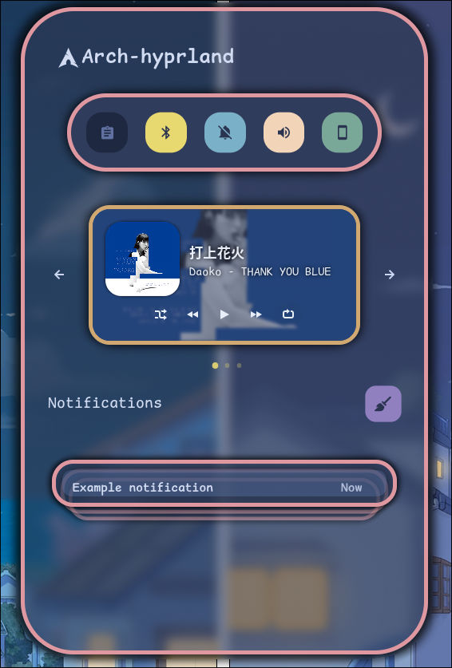
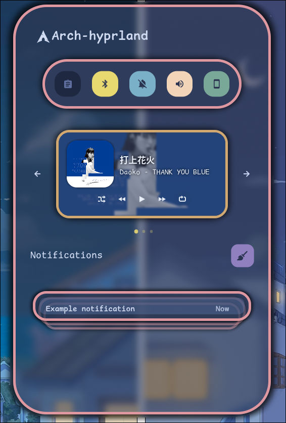
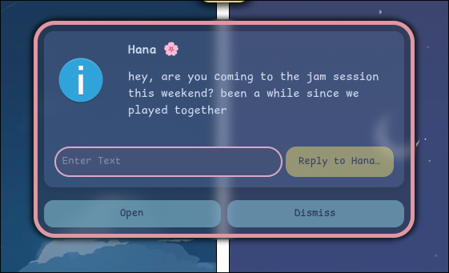
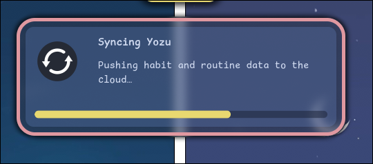

<div align="center">


# 夜桜 Yozakura — swaync Theme

A handcrafted pastel color palette for [swaync](https://github.com/ErikReider/SwayNotificationCenter), based on the [Yozakura](https://shunsui18.github.io/yozakura) palette.

[](LICENSE)
[](https://github.com/ErikReider/SwayNotificationCenter)
[](install.sh)
[](https://github.com/shunsui18/yozakura)

</div>

---

## ✦ Flavors

| | Flavor | Description |
|---|---|---|
| 🌙 | **Yoru** *(night)* | Deep, moonlit background with soft sakura accents |
| ☀️ | **Hiru** *(day)* | Warm ivory canvas with gentle pastel tones |

---

## ✦ Previews

### Notification Center

<table>
<tr>
<td align="center"><b>🌙 Yoru</b></td>
<td align="center"><b>☀️ Hiru</b></td>
</tr>
<tr>
<td></td>
<td></td>
</tr>
</table>

### Inline Reply

<table>
<tr>
<td align="center"><b>🌙 Yoru</b></td>
<td align="center"><b>☀️ Hiru</b></td>
</tr>
<tr>
<td></td>
<td></td>
</tr>
</table>

### Progress Bar

<table>
<tr>
<td align="center"><b>🌙 Yoru</b></td>
<td align="center"><b>☀️ Hiru</b></td>
</tr>
<tr>
<td></td>
<td></td>
</tr>
</table>

---

## ✦ Installation

### One-liner

Install directly from this repository with a single command:

```bash
bash <(curl -fsSL https://raw.githubusercontent.com/shunsui18/swaync/main/install.sh)
```

> Running without flags launches an **interactive menu** to pick your flavor.

---

### Options

| Flag | Values | Description |
|---|---|---|
| `--theme` | `yoru` \| `hiru` | Skip the menu and activate a specific flavor directly |
| `-h`, `--help` | — | Show help and list available flavors |

---

### Examples

```bash
# interactive menu
bash <(curl -fsSL https://raw.githubusercontent.com/shunsui18/swaync/main/install.sh)

# skip menu — yoru (night)
bash <(curl -fsSL https://raw.githubusercontent.com/shunsui18/swaync/main/install.sh) --theme yoru

# skip menu — hiru (day)
bash <(curl -fsSL https://raw.githubusercontent.com/shunsui18/swaync/main/install.sh) --theme hiru
```

---

### Manual Installation

If you prefer to install by hand:

```bash
# 1. Clone the repo
git clone https://github.com/shunsui18/swaync.git && cd swaync

# 2a. Interactive menu
bash install.sh

# 2b. Or pass a flavor directly
bash install.sh --theme yoru
```

---

## ✦ What the Installer Does

1. **Self-locates** — resolves its own path; in remote mode fetches all theme files from GitHub into a temp directory automatically
2. **Prompts** — shows an interactive flavor menu if no `--theme` flag is given; accepts a number or flavor name
3. **Validates** — confirms the requested flavor's CSS files exist before touching anything
4. **Creates** the full directory tree under `$HOME/.config/swaync/` if not already present
5. **Copies** all theme and config files:
   - `config.json` and `style.css` (root config)
   - Both flavor variants of `color-map-*.css` and `colors-*.css`
   - All component stylesheets under `styles/` (control center, notifications, widgets)
   - Notification alert sounds into `notification-alerts/`
   - Helper scripts into `scripts/` with executable permissions preserved
6. **Symlinks** the active flavor — `color-map.css` and `colors.css` point to the chosen variant, making flavor-switching a single re-run away
7. **Reloads** swaync live via `swaync-client --reload-config` if the daemon is already running
8. **Fails gracefully** — descriptive error messages if arguments are wrong or files are missing

---

## ✦ File Structure

```
swaync/
├── assets/
│   ├── notification-center-yoru-preview.png
│   ├── notification-center-hiru-preview.png
│   ├── notification-inline-reply-yoru-preview.png
│   ├── notification-inline-reply-hiru-preview.png
│   ├── notification-progress-bar-yoru-preview.png
│   └── notification-progress-bar-hiru-preview.png
├── notification-alerts/
│   ├── critical.mp3
│   └── normal.mp3
├── scripts/
│   ├── bt-toggle.sh
│   ├── kdeconnect-toggle.sh
│   └── notif-volume-wrapper.sh
├── styles/
│   ├── control-center-styles/
│   │   ├── button-grid-widget.css
│   │   ├── mpris-widget.css
│   │   └── notification-group.css
│   ├── notification-styles/
│   │   ├── content.css
│   │   └── critical.css
│   ├── control-center.css
│   └── notification.css
├── color-map-yoru.css
├── color-map-hiru.css
├── color-map.css  →  color-map-hiru.css  (symlink, active flavor)
├── colors-yoru.css
├── colors-hiru.css
├── colors.css     →  colors-hiru.css     (symlink, active flavor)
├── config.json
├── style.css
├── install.sh
├── LICENSE
└── README.md
```

---

<div align="center">

crafted with 🌸 by [shunsui18](https://github.com/shunsui18)

</div>
